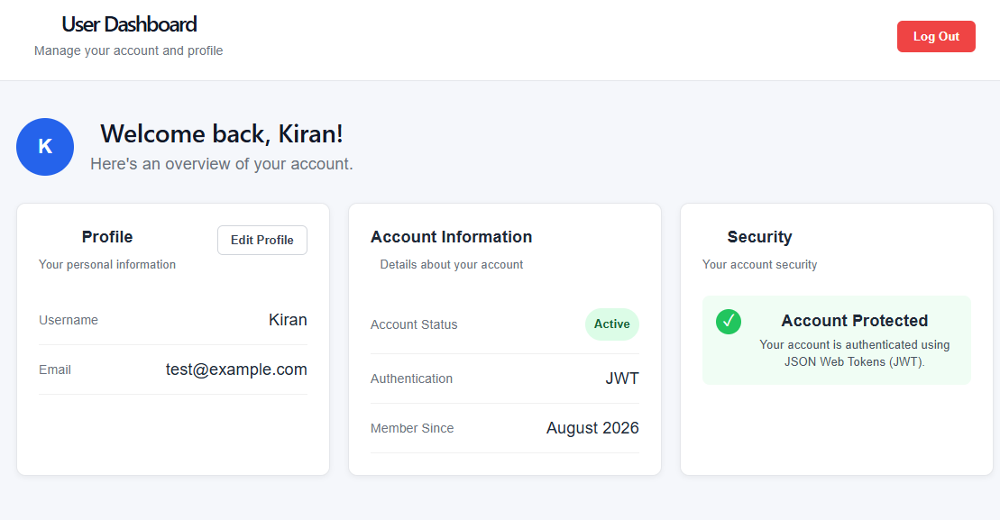

# User Dashboard

[](https://user-dashboard-q75zt7ail-kiran-265d.vercel.app/)



A React and TypeScript user dashboard application with profile management and logout functionality.

## Features

* User dashboard interface
* Display username and email
* Edit username and email
* Save profile changes
* Logout functionality
* React state management
* TypeScript type safety
* Responsive interface

## Technologies Used

* React
* TypeScript
* Vite
* CSS
* ESLint

## Getting Started

### Install dependencies

```bash
npm install
```

### Start the development server

```bash
npm run dev
```

Then open the local development URL provided by Vite.

## Project Purpose

This project was built to practice building React applications with TypeScript, managing component state, handling forms, passing props between components, and creating reusable UI functionality.
